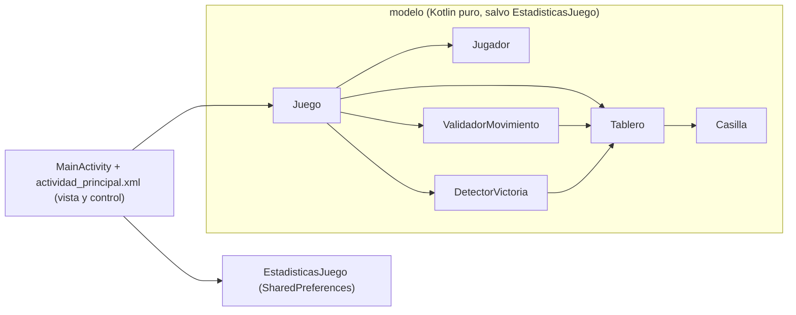

<div align="center">
  
  <h1>KotlinXO</h1>
  <p><b>Tres en Raya para Android en Kotlin: dos jugadores en el mismo móvil y estadísticas que sobreviven al cierre de la app.</b></p>
  
  
  
  
  <a href="https://github.com/Luiss2080/KotlinXO/actions/workflows/ci.yml"></a>
  <p>
    <a href="#-inicio-rápido">Inicio rápido</a> ·
    <a href="#-características">Características</a> ·
    <a href="#️-arquitectura">Arquitectura</a> ·
    <a href="#-pruebas">Pruebas</a> ·
    <a href="#-lo-que-todavía-no-existe">Limitaciones</a>
  </p>
</div>

**KotlinXO** es una app Android (Kotlin, vistas XML) del Tres en Raya para **dos jugadores en el mismo dispositivo**. El modelo del juego es Kotlin puro y se prueba en la JVM; las estadísticas (victorias de X, de O y empates) se guardan en `SharedPreferences`. Es un proyecto de aprendizaje/portafolio: **no** tiene IA, no está publicado y **no es un MVC completo** (no hay capa de controladores; `MainActivity` hace de vista y controlador).

## 🎬 Vista rápida

No hay capturas: no se pudo ejecutar en un emulador al preparar este README. Flujo real de una partida:

```text
  ┌────────────────────────────┐
  │ X: 3    O: 2    EMPATES: 1 │   estadísticas persistentes
  │ PARTIDAS JUGADAS: 6        │
  └────────────────────────────┘
        ┌───┬───┬───┐
        │ X │ O │   │   1. Toca una casilla vacía (X empieza siempre)
        ├───┼───┼───┤   2. La casilla muestra el símbolo jugado
        │   │ X │ O │   3. Al ganar o llenar el tablero aparece una tarjeta
        ├───┼───┼───┤      con un mensaje aleatorio de una lista fija
        │   │   │ X │      y el tablero se bloquea
        └───┴───┴───┘   4. [NUEVA PARTIDA] conserva las estadísticas
                           [RESET STATS] las borra, previa confirmación
```

## ✨ Características

| Característica | Detalle |
|---|---|
| Duelo local | Dos jugadores por turnos en 3x3; X empieza siempre. Orientación **vertical** (`screenOrientation="portrait"`). |
| Victoria | Las **8 líneas** (filas, columnas, 2 diagonales) vía `DetectorVictoria`. |
| Empate | Solo con tablero lleno y sin ganador; ganar en la novena jugada es victoria. |
| Jugadas válidas | `ValidadorMovimiento` rechaza casillas ocupadas y fuera del tablero; además, la vista deshabilita las casillas al terminar. |
| Estadísticas persistentes | Victorias X/O, empates y partidas totales en `SharedPreferences`; sobreviven al cierre. Reinicio con diálogo de confirmación. |
| Fin de partida | Tarjeta con mensaje aleatorio (5 variantes por resultado) y animación de aparición de 500 ms. |
| Recreación de actividad | Tablero y turno se guardan en `onSaveInstanceState` (p. ej. cambio de modo claro/oscuro del sistema). |

## 🏗️ Arquitectura

Paquete `com.example.tresenrayakotlin`. Un modelo puro, una clase de persistencia que necesita `Context` y una actividad que une todo.



`Juego` coordina `Tablero`, `ValidadorMovimiento` y `DetectorVictoria`, y serializa/restaura su estado como una cadena de 9 caracteres `X`/`O`/`-`.

## 🚀 Inicio rápido

| Requisito | Versión |
|---|---|
| JDK | 17 (lo pide Android Gradle Plugin 8.x) |
| Android SDK | plataforma API 33 (`compileSdk`/`targetSdk` 33, `minSdk` 24) |
| Gradle / AGP / Kotlin | wrapper Gradle 8.11.1, AGP 8.7.3, Kotlin 2.1.0 |

1. Clona el repositorio:
   ```bash
   git clone https://github.com/Luiss2080/KotlinXO.git
   cd KotlinXO
   ```
2. Compila el APK de depuración (`app/build/outputs/apk/debug/`; usa el sufijo `.debug` en el `applicationId`):
   ```bash
   ./gradlew assembleDebug
   ```
3. Instálalo en un emulador o dispositivo conectado:
   ```bash
   ./gradlew installDebug
   ```

También puedes abrir el proyecto en Android Studio y pulsar **Run**. Si hace falta, crea `local.properties` con `sdk.dir=<ruta-a-tu-SDK>` (ignorado por git).

> Verificación: no ejecuté la compilación (no había Android SDK ni JDK 17 en la máquina); los pasos salen de la configuración del proyecto y de la CI.

<details>
<summary>📁 Estructura de carpetas</summary>

```text
app/src/main/java/com/example/tresenrayakotlin/
  MainActivity.kt
  modelo/  Juego, Tablero, Casilla, Jugador, DetectorVictoria,
           ValidadorMovimiento, EstadisticasJuego
app/src/main/res/layout/actividad_principal.xml
app/src/test/  4 clases de test JUnit 4 (JVM)
app/src/androidTest/  solo el ExampleInstrumentedTest de la plantilla
.github/workflows/ci.yml
```

</details>

## 🧪 Pruebas

```bash
./gradlew test
```

Hay **27 tests JUnit 4** (conteo de métodos `@Test` en el código; no pude ejecutarlos localmente, la CI los ejecuta en cada push y pull request con JDK 17): `DetectorVictoriaTest` (6), `JuegoTest` (9), `JuegoEstadoTest` (5) y `TableroYValidadorTest` (7). Cubren las 8 líneas, líneas incompletas o mezcladas, empate, victoria en la última casilla, turnos, casillas ocupadas o fuera de rango, bloqueo tras terminar, reinicio y serialización del estado.

**No** hay tests de `MainActivity` ni de `EstadisticasJuego` (necesitan Android).

## 🚧 Lo que todavía no existe

- IA, modo de un jugador, sonidos o multijugador en línea.
- La interfaz **no muestra de quién es el turno**: los recursos `turno_jugador_x/o` existen pero no se usan.
- Solo modo vertical. Hay un tema nocturno (`values-night`), pero el layout usa colores fijos, así que la adaptación al modo oscuro es parcial (no la pude comprobar visualmente).
- Varios textos (mensajes de fin de partida, diálogos, toasts) están escritos en el código Kotlin y no en `strings.xml`; solo español.
- Las dependencias de `app/build.gradle.kts` están escritas a mano y no usan el catálogo `gradle/libs.versions.toml`.
- `applicationId` de plantilla (`com.example.tresenrayakotlin`); el build *release* no está firmado ni minificado.
- Solo la lógica del modelo tiene tests; el comportamiento en un dispositivo real no está verificado automáticamente.

## 📄 Licencia

Sin licencia definida: todos los derechos reservados por defecto. Para permitir su reutilización habría que añadir un archivo `LICENSE`.

<div align="center"><sub>Hecho por Luiss2080 · Tres en Raya en Kotlin, con lógica probada en la JVM</sub></div>
